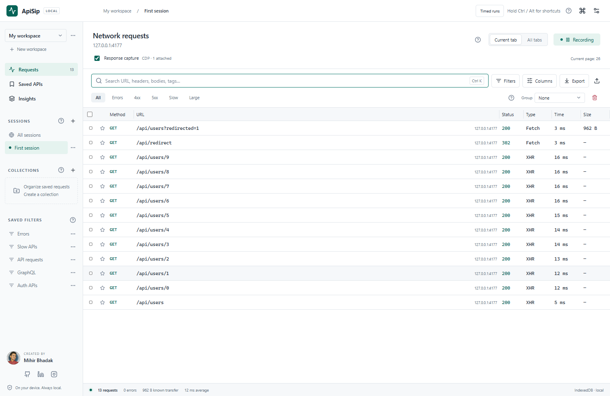
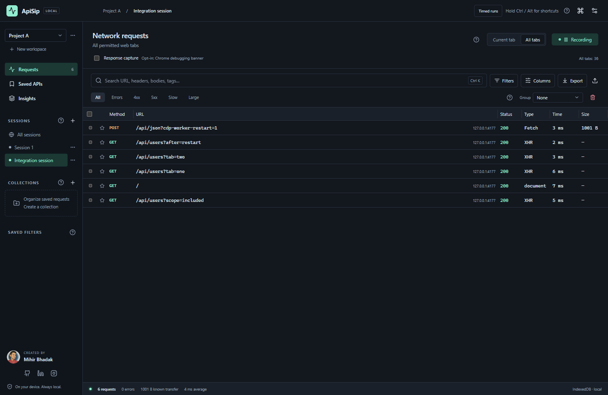

# ApiSip

A privacy-first Chrome extension to capture, inspect, edit, replay, and load-test APIs. Includes multi-tab capture, advanced filters, response comparisons, performance analytics, code generation, and HAR/JSON exports. Local-first storage, no telemetry, and no cloud dependency.

The extension icon opens a full-page developer tool. Built by [Mihir Bhadak](https://github.com/mihirbhadak).

[Website & installation guide](https://mihirbhadak.github.io/ApiSip/) · [Download the latest release](https://github.com/mihirbhadak/ApiSip/releases/latest) · [Support ApiSip](https://buymeacoffee.com/mihir_bhadak/apisip)



<details>
<summary>Dark theme</summary>



</details>

## Technology

TypeScript, React 19, Vite, Chrome Manifest V3, IndexedDB with `idb`, Zod, and Lucide icons. Tests use Vitest, React Testing Library, Playwright, and axe. Timed runs and body searches use bundled Web Workers.

## Install a release

Download the extension ZIP from [GitHub Releases](https://github.com/mihirbhadak/ApiSip/releases), extract it, then select the extracted folder with **Load unpacked** at `chrome://extensions` after enabling **Developer mode**. Select the folder containing `manifest.json`; Chrome cannot load the ZIP directly. Chrome 125 or newer is required.

## Run locally

Requires Node.js 22.12+ and npm.

```sh
git clone https://github.com/mihirbhadak/ApiSip.git
cd ApiSip
npm ci
npm run build
```

1. Open `chrome://extensions`.
2. Enable **Developer mode**.
3. Choose **Load unpacked** and select **the cloned `ApiSip` folder** (this repository's root). The production build generates a root manifest that points to the built files in `dist`.
   Alternatively, `dist` is a standalone extension folder suitable for packaging. Use one installation path consistently: Chrome assigns separate extension identities and local history to different folders.
4. The first-install setup page explains website access. Click **Allow website access** to open Chrome's permission prompt, or continue without capture.
5. Open an HTTP(S) web page, then click **Start recording** in setup or **Start capture** in the inspector.
6. **Response capture is enabled by default on new installations.** Chrome shows a debugging notice while recording. Disable it for passive metadata capture. Existing saved preferences are preserved.
7. Use **Alt + Shift + C** from a webpage to start/stop recording. Chrome may reserve or reassign shortcuts; Settings shows the actual assignment and links to `chrome://extensions/shortcuts`.

The toolbar icon is teal while recording and gray while paused. Clearing requests does not pause recording; new traffic continues into the active session. Deleting the active workspace/session creates or selects a replacement capture destination. Archiving the active session still pauses it.

### Updates

ApiSip 0.1.2 and later checks the public GitHub Releases API at most once a day and shows a newer stable version's changes and fixes. Use **Updates** for a manual check, or disable automatic checks in **Settings → Privacy & storage**. No captured data is sent. Unpacked extensions cannot update themselves: export a backup, finish active runs, replace the files in the same extension folder with the new ZIP contents, then click **Reload** at `chrome://extensions` and reload inspector tabs. Install 0.1.2 manually once to receive future update notices.

### Fix "Manifest file is missing or unreadable"

Run `npm run build` from this repository, then retry **Load unpacked** with the repository root (for example, `D:\Projects\ApiSip` on Windows), or select its built `dist` folder. The build creates both `manifest.json` at the root and the standalone `dist/manifest.json`. Do not load `src` or `public`; they do not contain the complete production extension. Keep `dist` beside the root manifest. If Chrome already has ApiSip installed, use **Reload** on that extension card after rebuilding.

After source changes, build again and click **Reload** on the extension card. `npm run dev` serves the UI for development, but capture and replay require the installed extension.

## Capabilities

- Current-tab and all-tabs capture, pause/resume, persistent sessions and live badge counts.
- Passive request metadata, available upload bodies, headers, statuses, redirects and errors.
- Chrome debugger/CDP capture for available response bodies, timings, cache information, GraphQL and bounded WebSocket messages; enabled by default for new installations after recording is started.
- Virtualized, sortable request table; configurable columns, pinning, favorites, multi-selection and resizable details.
- Global search through URLs, headers, query values, bodies, tags and notes in a separate worker.
- Nested AND/OR/NOT filters, visual builder, expression editor, saved filters and quick filters.
- Persistent workspaces, sessions, collections, editable saved requests, tags and notes.
- Request editor with query/header/body editing, browser-context and extension-context replay, history and structural JSON comparison. Open an editor in its own tab with persistent, automatically saved drafts.
- Timed API runs in the extension: paced starts, optional ramp-up, bounded concurrency, body/header variables, streamed measurements, live charts, failure limits and saved reports.
- cURL/Bash/CMD, PowerShell, JavaScript fetch/Axios, TypeScript fetch, Python requests/httpx, Go, Java, C#, PHP, Ruby, Rust and HTTPie generators.
- JSON, CSV, Markdown, HAR and text exports; versioned JSON/HAR imports; sensitive values excluded by default.
- Local statistics, status/type/domain/latency distributions, endpoint grouping and slow/large-request lists.
- System/light/dark themes, keyboard shortcuts, command palette, diagnostics, retention controls and destructive-action confirmations.

## Dashboard controls and help

- Three-dot menus close on outside click, Escape, Tab or after an action. Use arrows and Home/End to navigate; Enter activates an action. Delete and clear actions stay red.
- The header checkbox selects all matching requests, including rows off screen. A dash means partial selection. Ctrl/Cmd + A selects all when the request list has focus. Deselect clears the entire selection, including requests outside the current filters.
- Dropdowns support typing to search, arrows to navigate and Enter to choose. Escape cancels; Tab moves on. Field and method pickers accept custom values with Enter.
- Filters offer common defaults and bounded suggestions from the current capture scope, without loading bodies or suggesting recognized credential values. `XHR` and `XMLHttpRequest` match the same resource type. Enter selects a value, then Enter again applies; in expression mode Enter applies and Shift + Enter adds a line.
- Right-click a populated table cell and choose **Add filter**, or double-click it to filter immediately. Cell rules are combined with AND while preserving existing OR/NOT groups. Repeated rules are deduplicated; missing values and masked secrets are excluded. In the selected row, use Left/Right between cells, Enter to filter, or Shift + F10 for its menu. Time and size match exact captured values, before display rounding.
- The ? buttons open a searchable guide covering capture, filters, organization, details, replay, exports, analytics, privacy and settings.
- Hold Ctrl, Cmd or Alt alone for one second to reveal shortcuts without moving focus. Release the key, press another key or leave the window to dismiss the hints.
- Section tabs support Left/Right and Home/End. The command palette displays its shortcuts.

### Creator

Built by **Mihir Bhadak**. [GitHub](https://github.com/mihirbhadak), [LinkedIn](https://www.linkedin.com/in/mihirbhadak/), [Instagram](https://www.instagram.com/mihir_bhadak/), [Buy me a coffee](https://buymeacoffee.com/mihir_bhadak/apisip). His profile photo is bundled locally. Links open only when clicked; no remote social or payment widgets are loaded. Support is optional and does not gate features.

## Capture modes and limitations

**Passive capture** uses Chrome's `webRequest` observer. It does not modify traffic and cannot read response bodies. Response size and detailed timing are unavailable when the provider does not expose them.

**Response capture** attaches `chrome.debugger` to supported tabs and observes CDP Network events. Chrome displays a debugging notice. Opening DevTools, another debugger, enterprise policy, navigation or a closed target can prevent or terminate attachment. Passive metadata capture remains available when attachment fails. The settings diagnostics tab provides a retry action.

Neither mode captures literally all browser networking. Chrome-internal pages, other extensions, sensitive browser requests, traffic before capture starts, inaccessible targets and some background/service-worker/cache activity are excluded or incomplete. Related iframe/worker targets are instrumented where Chrome allows them; this is not a guarantee of complete frame or worker coverage. Captures are observations, not packet traces.

- Bodies can be evicted, omitted, streamed indefinitely, inaccessible, or larger than CDP's buffer. Unavailability and truncation are displayed explicitly.
- Body limits are 1, 5, 10 or 25 MB. Unlimited capture is deliberately unavailable.
- Multipart upload file content and original wire boundaries may be missing. Incomplete/binary/multipart bodies must be replaced before replay or reproducible code generation.
- Captured HTTP/2 and HTTP/3 pseudo-headers (`:authority`, `:method`, `:path`, `:scheme`, `:protocol`, `:status`) stay visible in captured data but are omitted from replay, timed runs and code snippets. Edit the request URL and method instead; the HTTP client generates protocol fields. Existing saved editor drafts use this behavior without recapturing.
- WebSocket capture keeps up to 200 messages per connection and 16 KB per payload; it does not replay WebSocket conversations.
- Header duplicates are preserved when exposed. Extra-info ordering across redirects can be ambiguous, so primary-event headers are used for those hops.
- Raw mode reconstructs exposed fields; it cannot reproduce HTTP/2 frames or the exact bytes sent on the network.
- Regex filters support literals, anchors, character classes and at most one repetition anchored at the beginning. Groups, alternatives, backreferences and counted repetitions are rejected to bound search cost.
- P95 appears after 20 measured durations and P99 after 100. Missing timings and sizes are not invented.
- Current-tab capture follows the most recently active supported web tab. Opening the inspector preserves that target. If no target exists when capture starts, a supported active/recent tab is selected.
- Sessions continue across navigation. Optional navigation cleanup removes unsaved completed requests; SPA/hash changes preserve history.

## Replay behavior

**Browser** runs a bundled fetch function in the source tab's isolated content-script world. It uses that tab's cookie/CORS context and refuses a changed source origin. Closed tabs and CORS restrictions produce a recorded error.

**Extension** fetches from the extension worker with granted host access. It omits ambient cookies. It is useful for cross-origin API calls but does not reproduce the source page's identity automatically.

Automatic selection prefers the browser context when a source tab exists. Requests are never automatically retried in another context. Fetch controls forbidden headers such as Cookie, Origin, Referer, Host, Content-Length and Sec-*. The inspector lists omitted headers. Response headers may be filtered by fetch, especially Set-Cookie. Replays time out after 25 seconds and retain the latest 30 results per request.

### Editor in a new tab

1. Select a captured request and choose **Replay**.
2. Click **Open in new tab**. Your current URL, query, header, body and context edits go with you. The external-link button in the details header also opens an editor, starting from the captured request.
3. Edit and click **Send**, or press **Ctrl/Cmd + Enter**. The adjacent panel shows the response, headers, replay history and comparison with the original. Both replay contexts use the same behavior described above.
4. Edits save locally after a short typing pause. Wait for **Draft saved locally** before closing; reloading or restoring the same tab recovers the draft. The captured request stays intact. **Save as new request** adds an editable copy to Saved APIs.
5. **Open inspector** returns to the dashboard. Replay results are shared with the original request there. **Discard draft** removes only that draft after confirmation.

Each click opens an independent draft. Duplicating an existing browser tab shares its draft; conflicting saves are rejected with a reload action. Only a random draft ID appears in the tab URL. Drafts and their source requests are protected from automatic retention and navigation cleanup. Explicitly deleting their source request, session, workspace or history removes the related drafts. Drafts are not included in exports; save a request copy first. Browser-context replay still requires the original source tab and origin to remain available.

## Timed API testing

1. Select an API, choose **Replay → Open in new tab**, and edit its URL, headers and body.
2. Choose **Timed run**. Enter **Requests to schedule** and a **Start window** in seconds or minutes. For example, **10,000 / 1 minute** plans an average of **166.67 starts/second**.
3. Set maximum concurrency and a per-request timeout. Optional advanced controls add linear ramp-up, acceptable status codes, a latency budget, a response read limit and automatic stopping on consecutive failures or HTTP 429.
4. Use **Review run** (Ctrl/Cmd + Enter in the configuration panel), inspect the target and masked first-slot preview, then **Start run**.
5. Watch **Run analytics**, or close the editor and use **Timed runs** in the dashboard to monitor or stop. **Report JSON** exports aggregates; **Sample CSV** exports the retained attempt samples.

The time is a **window for starting requests**, not a guarantee that all responses finish within it. Scheduling reserves at most 1% of the window (capped at 50 ms and the allowed start delay) at the end for normal timer granularity; ramp-up is clamped to the remaining scheduling interval. Slow responses, concurrency limits, computer sleep or late browser timers can leave slots unsent. These are counted separately; the runner does not flood the API with catch-up requests. Requests already in flight may finish after the window, within their timeouts. For a starting concurrency estimate, multiply planned starts/second by typical response duration in seconds: 166.67 × 0.2 s needs about 34 simultaneous requests. Validate with the API's actual capacity and measured delays.

### Changing values per request

Put placeholders in the editor before switching to Timed run:

```text
URL:    https://api.example.com/users/{{userId}}?attempt={{index}}
Header: X-Test-Request: {{uuid}}
Body:   {"userId":"{{userId}}","name":"{{name}}","attempt":"{{index}}"}
```

Under **Variables & data rows**, add custom constants or JSON rows such as:

```json
[
  { "userId": 1, "name": "Mihir" },
  { "userId": 2, "name": "Ada" }
]
```

Rows cycle by scheduled slot and override constants. `{{index}}` is one-based, so missed slots leave gaps. `{{uuid}}` and `{{timestamp}}` change per attempt; `{{randomInt}}` is a seeded integer from 0 to 999,999. JSON placeholders must be quoted: an entire placeholder preserves the supplied scalar type, while embedded text is escaped. URL/form substitutions are encoded. Headers and plain text use literal substitutions. The target origin must stay fixed. No scripts or expressions are executed.

### Measurements and resource limits

- Counts: planned, started, finished, passed/failed/cancelled, missed timing/capacity slots, outstanding requests and peak concurrency.
- Timing: attempt duration, time until exposed headers, body read, scheduled-start delay and timer lag. Each has sample count, min/mean/max, standard deviation and approximate P50/P95/P99. P95 needs 20 samples; P99 needs 100.
- Charts and distributions: starts/completions over time, attempt durations, outcome categories and HTTP status counts; decoded bytes read and achieved throughput.
- Responses are streamed, counted and discarded. A dedicated Web Worker performs the run; the UI updates once a second. Fixed histograms, at most 241 timeline buckets, the latest 100 attempts and first 20 failures keep report memory bounded. History retains the latest 50 reports globally.
- Limits: one active run, 1–1,000,000 planned requests, 1 second–60 minutes, peak planned rate ≤1,000/second, concurrency ≤128, timeout 100 ms–120 seconds, request text ≤1 MiB, up to 100 headers/variables and 1,000 scalar data rows. The combined plan is capped at 1.5 million serialized characters. Response read limits are 1/5/10/25 MiB; one received chunk can cross the limit before cancellation.

**Chrome boundaries:** timed runs use the extension context with granted site access, without ambient page cookies. Forbidden headers are omitted and listed. Redirects are not followed, and requests are never automatically retried. Ordinary browser-context replay remains available for single requests. DNS, connect/TLS, exact wire TTFB, compressed wire bytes, server processing time and whole-computer CPU/memory are unavailable in this fetch runner. Header timing includes browser queueing; it is not an isolated server-latency measurement. Browser preflights are not counted as scheduled attempts.

Closing the editor does not stop a run. Closing Chrome, reloading the extension or losing its worker interrupts it. Saved checkpoints recover as **interrupted**, with unresolved outcomes identified; no requests restart automatically. Revoking site access or deleting the source history stops an active run. Reports omit request payloads, credentials, full URLs and variable values, but include the target origin and source identifiers. Run configurations/rows are not restored after leaving the run panel; edited API drafts remain locally saved. Reports have their own JSON export and are excluded from general history backups.

This uses bundled Chrome/Web APIs with no native installation or OS-specific executable. Low overhead is a design goal, not a universal CPU/RAM or throughput guarantee. See [TESTING.md](TESTING.md) for actual Chrome measurements and verification boundaries.

## Permissions

| Permission                           | Purpose                                                                                                                                                                   |
| ------------------------------------ | ------------------------------------------------------------------------------------------------------------------------------------------------------------------------- |
| Optional `webRequest`                | Observe permitted requests without interception or blocking.                                                                                                              |
| `debugger`                           | CDP response-body, timing and WebSocket capture. Chrome **does not allow** this permission to be optional; attachment requires recording and the response-capture switch. |
| `activeTab`                          | Identify the page when the extension icon is clicked.                                                                                                                     |
| `scripting`                          | Execute the fixed browser-context replay function in the selected source tab.                                                                                             |
| `storage`                            | Keep the capture epoch and small update-check cache; request data uses IndexedDB.                                                                                         |
| `alarms`                             | Run periodic local retention cleanup and optional daily release checks.                                                                                                   |
| `offscreen`                          | Host the dedicated worker for a user-started timed run, using Chrome's WORKERS reason; close the host when idle.                                                          |
| Optional `http://*/*`, `https://*/*` | Observe APIs and initiators across supported sites and perform explicit replay. Requested by a click in setup or when capture starts.                                     |

No blocking/interception, cookies API, history API, native messaging, cloud service, remote scripts, telemetry or hidden analytics. Clipboard writing uses the user's click/shortcut and requires no blanket clipboard permission.

## Privacy and data management

Captured content may contain credentials. Masking affects display and export; **stored data is not encrypted**. Use a dedicated browser profile for sensitive debugging and clear history when finished. Known secret names, Bearer/Basic credentials and JWT-like values are redacted; arbitrary unstructured secrets may require manual review. See [PRIVACY.md](PRIVACY.md).

Retention defaults to 30 days, 10,000 requests and an approximate 500 MB budget. Cleanup runs every five minutes. Favorites, pinned requests, collection members and editor draft sources are protected and may exceed those limits. Settings exposes explicit clearing actions. Import/export files are capped at 100 MB; export smaller selections for large histories.

## Shortcuts

| Shortcut                          | Action                                      |
| --------------------------------- | ------------------------------------------- |
| Alt + Shift + A                   | Open or focus the inspector                 |
| Ctrl/Cmd + K or F                 | Search requests                             |
| Ctrl/Cmd + Shift + P              | Command palette                             |
| Ctrl/Cmd + Enter                  | Send from request editor                    |
| Ctrl/Cmd + Shift + C              | Copy cURL                                   |
| Ctrl/Cmd + E                      | Export                                      |
| Alt + Shift + C                   | Start or pause capture                      |
| Alt + Shift + N / W / L           | New session / workspace / collection        |
| Alt + Shift + F / S / H           | Open filters / settings / help              |
| Alt + Shift + R                   | Focus the request list                      |
| Ctrl/Cmd + A                      | Select all matching requests (focused list) |
| Space                             | Toggle focused request selection            |
| Shift + F10                       | Open the focused request menu               |
| Arrow keys, Home, End             | Navigate the focused request list           |
| Left / Right, Home / End          | Navigate section tabs                       |
| Type, Up / Down, Enter            | Search dropdowns and choose an option       |
| Delete                            | Confirm deletion of selected requests       |
| ?                                 | Open help (outside text fields)             |
| Hold Ctrl/Cmd or Alt for 1 second | Reveal shortcuts                            |
| Escape                            | Close a menu, dropdown, dialog or details   |

Alt + Shift + A is a Chrome extension command; configure it at `chrome://extensions/shortcuts` if Chrome preserves an unassigned or conflicting shortcut. The remaining shortcuts apply while the inspector has focus. Normal editing keys are preserved in form controls.

## Development and verification

See [DEVELOPMENT.md](DEVELOPMENT.md), [ARCHITECTURE.md](ARCHITECTURE.md), and [TESTING.md](TESTING.md). Optional interception/mocking, environment-variable secrets, OpenAPI/Postman import, remote sharing and cloud sync are intentionally outside this implementation.

The public website is authored in `website` and built into [`docs`](docs/README.md), served over HTTPS by GitHub Pages at <https://mihirbhadak.github.io/ApiSip/>; see [hosting verification](TESTING.md#hosting-verification). Run `npm run site:dev` for a local preview and `npm run test:site` for its browser checks. Its screenshots use only the bundled local API test server. Website downloads open an optional creator/support dialog and move the background to the installation guide; the download itself is never gated. See the [website analytics, feedback and search guide](WEBSITE-GUIDE.md) for setup. Optional website metrics are separate from the telemetry-free extension.
